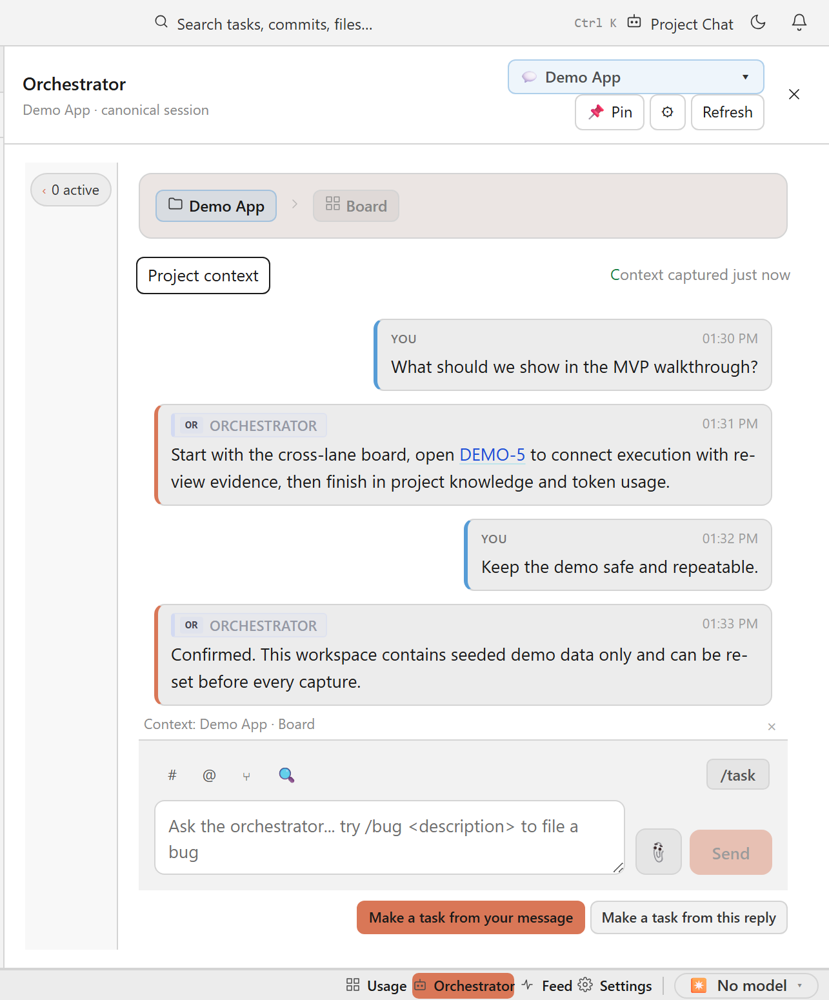

# coding-agent-chat

A standalone **Angular library** that renders the chat UI of a coding agent —
plus a demo/playground ("Conversation Lab"). The frontend counterpart to
[`coding-agent-runner`](https://github.com/agent-orc/runner): the runner
produces the server-side event stream, this library renders it.

<picture>
  <source media="(prefers-color-scheme: dark)" srcset="docs/media/conversation-view-dark.png">
  
</picture>

This is an Angular CLI workspace (Angular 21.2, `ng-packagr`):

| Project | Path | Purpose |
|---|---|---|
| `coding-agent-chat` | [`projects/coding-agent-chat`](projects/coding-agent-chat) | the publishable library |
| `conversation-lab` | [`projects/conversation-lab`](projects/conversation-lab) | demo / playground app (dev server port 4201) |
| `website` | [`projects/website`](projects/website) | public website (GitHub Pages) with live component demos (dev server port 4202) |

Each app has a fixed dev-server port in `angular.json`, so both can run side
by side (`npm run lab` → 4201, `npm run website` → 4202).

## Build

```sh
npm install
npm run build        # ng build coding-agent-chat → dist/coding-agent-chat
```

## Conversation Lab (scenario testbed)

The lab is the place to exercise the library against every interesting
transcript shape. A scenario picker offers three kinds of scenarios
(catalog: `projects/conversation-lab/src/app/lab-scenarios.ts`):

- **Replay** — scripted `CliOutputLine` feeds played through the *same*
  projection (`projectConversation`) the live mode uses: happy path,
  failing test + retry, watchdog wait-loop/kill, needs-input, model switch
  across runs, stderr crash, and a long 10-block run. Play them streamed
  (line-by-line, simulating a live session) or instantly; composer submits
  append real `user`-stream lines.
- **Live** — preset prompts that drive a REAL coding-agent CLI (Claude
  Code / Codex / Gemini) through the workbench host in `workbench/` (a .NET
  Minimal API wrapping the CodingAgentRunner NuGet package, port 5055).
  Each preset provokes a specific event shape (tool rows, failing command,
  todo plan); "Szenario starten" tears down the previous session, so runs
  stay reproducible. Agent runs execute in `workbench/sandbox/`.
- **Fixture** — hand-built `ConversationEvent`s for renderer-only rows
  (image artifacts, orchestrator decision with retry budget, token metric).

The history panel is backed by an in-memory `PROJECT_CHAT_DATA_SOURCE`; the
studio theme ships from the package CSS (`theme/cac-theme.css`, dark by
default) with a dark/light toggle flipping `data-studio-theme`.

```sh
npm run build                    # build the library first — the demo consumes dist/
npm run lab                      # ng serve conversation-lab → http://localhost:4201
npm run workbench                # .NET workbench host → http://localhost:5055 (live scenarios)
npx ng build conversation-lab    # production build → dist/conversation-lab
```

## Website (GitHub Pages)

The public site for the library — hero, an animated live replay of a
conversation rendered by `<cac-conversation-view>` + `<cac-chat>`, a
`<cac-project-chat-list>` history demo over an in-memory
`PROJECT_CHAT_DATA_SOURCE`, feature grid and docs. Like the lab it consumes
the built `dist/` output and the packaged studio theme.

```sh
npm run build                    # build the library first — the site consumes dist/
npm run website                  # ng serve website → http://localhost:4202
npx ng build website             # production build → dist/website
```

Deployed automatically by [`.github/workflows/pages.yml`](.github/workflows/pages.yml)
on every push to `main` (base href `/coding-agent-chat/`, SPA `404.html` fallback).

## Develop against the library (watch)

```sh
ng build coding-agent-chat --watch
```

Consumers should depend on the **built `dist/`** output (not the source) — this
exercises the published partial-Ivy compile mode and catches strict-template
mismatches early. The Conversation Lab demo follows the same rule: its
tsconfig paths resolve `coding-agent-chat/*` to `dist/`, so rebuild the
library before serving the demo.

## Versioned releases and consumer upgrades

`coding-agent-chat` uses SemVer and immutable `v<version>` git tags. A tagged
release is built from that exact commit by `.github/workflows/release.yml`; the
workflow rejects a tag/package-version mismatch and publishes with npm's
provenance attestation. The package exports `CODING_AGENT_CHAT_RELEASE_INFO`,
and includes `release-manifest.json` with the version, tag, full commit, the
commit-derived UTC build timestamp, and SHA-512 hashes for every publishable
payload file. npm adds the final tarball integrity at publication. The Conversation Lab prints this exact identity in its
header.

Upgrade a registry consumer with `npm install --save-exact
coding-agent-chat@0.2.1` and commit `package-lock.json`. Agent Studio may instead
consume a reviewed, pinned artifact: download `coding-agent-chat-0.2.1.tgz`,
verify it against the release manifest/provenance, store it in the Studio
artifact location, then use `npm install --save-exact
./artifacts/coding-agent-chat-0.2.1.tgz`. Do not point Studio at a mutable local
`dist/` directory or an unversioned tarball.

After unpacking a downloaded artifact, its payload can be checked with
`node scripts/verify-release.mjs <unpacked-package-directory>`. The verifier
checks both npm's effective publish file list and every recorded SHA-512 digest.

Compatibility follows SemVer: patch upgrades are fixes, minor upgrades are
backward-compatible additions, and major upgrades may require host changes.
CAC 0.2.x requires Angular 21 (`>=21 <22`) and RxJS `~7.8`; check
`CHANGELOG.md`, update the pinned version, run the host tests/build, and verify
the Lab/Studio runtime release label before deployment.

This release packages the CAC-6 public library surface, CAC-7 host integration,
and CAC-8 Conversation Lab validation into the reproducible delivery contract
tracked by CAC-9.

## License

[Apache-2.0](LICENSE)
