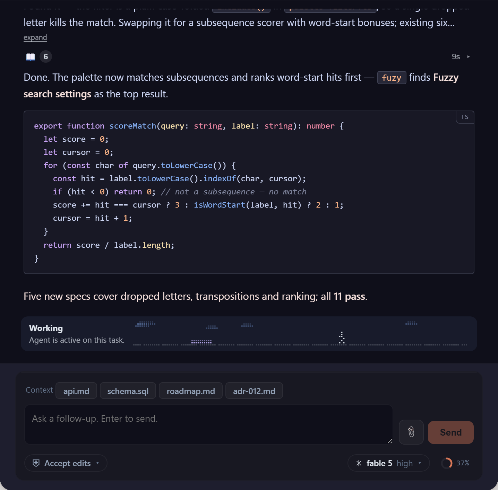

# coding-agent-chat

A standalone **Angular library** that renders the chat UI of a coding agent —
plus a demo/playground ("Conversation Lab"). The frontend counterpart to
[`coding-agent-runner`](https://github.com/agent-orc/runner): the runner
produces the server-side event stream, this library renders it.



**Live demo:** [agent-orchestrator.dev/chat](https://agent-orchestrator.dev/chat/)

Angular CLI workspace (Angular 21.2, `ng-packagr`):

| Project | Path | Purpose |
|---|---|---|
| `coding-agent-chat` | [`projects/coding-agent-chat`](projects/coding-agent-chat) | the publishable library |
| `conversation-lab` | [`projects/conversation-lab`](projects/conversation-lab) | demo / playground app (port 4201) |
| `website` | [`projects/website`](projects/website) | public website with live component demos (port 4202) |

## Build

```sh
npm install
npm run build        # ng build coding-agent-chat → dist/coding-agent-chat
```

## Conversation Lab

A scenario testbed for every transcript shape
(catalog: `projects/conversation-lab/src/app/lab-scenarios.ts`):

- **Replay** — scripted `CliOutputLine` feeds played through the same
  projection the live mode uses (happy path, failing test + retry,
  watchdog, needs-input, model switch, stderr crash, long run).
- **Live** — preset prompts that drive a real coding-agent CLI through the
  .NET workbench host in `workbench/` (port 5055).
- **Fixture** — hand-built `ConversationEvent`s for renderer-only rows.

```sh
npm run build        # build the library first — the demo consumes dist/
npm run lab          # ng serve conversation-lab → http://localhost:4201
npm run workbench    # .NET workbench host → http://localhost:5055
```

## Website

The public site for the library — animated live replay rendered by
`<cac-conversation-view>` + `<cac-chat>`, history demo, docs. Deployed by
[`.github/workflows/pages.yml`](.github/workflows/pages.yml) on every push
to `main`.

```sh
npm run build        # build the library first — the site consumes dist/
npm run website      # ng serve website → http://localhost:4202
```

## Develop against the library

```sh
ng build coding-agent-chat --watch
```

Consumers depend on the built `dist/` output, not the source — this exercises
the published partial-Ivy compile mode and catches strict-template mismatches
early.

## Releases

SemVer with immutable `v<version>` git tags. A tagged release is built from
that exact commit by `.github/workflows/release.yml` and published with npm
provenance. Each package includes `release-manifest.json` (version, tag,
commit, build timestamp, SHA-512 hashes); verify an unpacked package with
`node scripts/verify-release.mjs <dir>`.

Upgrade a registry consumer with `npm install --save-exact
coding-agent-chat@0.2.2` and commit `package-lock.json`. Agent Studio may instead
consume a reviewed, pinned artifact: download `coding-agent-chat-0.2.2.tgz`,
verify it against the release manifest/provenance, store it in the Studio
artifact location, then use `npm install --save-exact
./artifacts/coding-agent-chat-0.2.2.tgz`. Do not point Studio at a mutable local
`dist/` directory or an unversioned tarball.

After unpacking a downloaded artifact, its payload can be checked with
`node scripts/verify-release.mjs <unpacked-package-directory>`. The verifier
checks both npm's effective publish file list and every recorded SHA-512 digest.

Compatibility follows SemVer: patch upgrades are fixes, minor upgrades are
backward-compatible additions, and major upgrades may require host changes.
CAC 0.2.x requires Angular 21 (`>=21 <22`) and RxJS `~7.8`; check
`CHANGELOG.md`, update the pinned version, run the host tests/build, and verify
the Lab/Studio runtime release label before deployment.

This release packages the CAC-6 public library surface, CAC-7 host integration,
and CAC-8 Conversation Lab validation into the reproducible delivery contract
tracked by CAC-9.

## License

[Apache-2.0](LICENSE)
