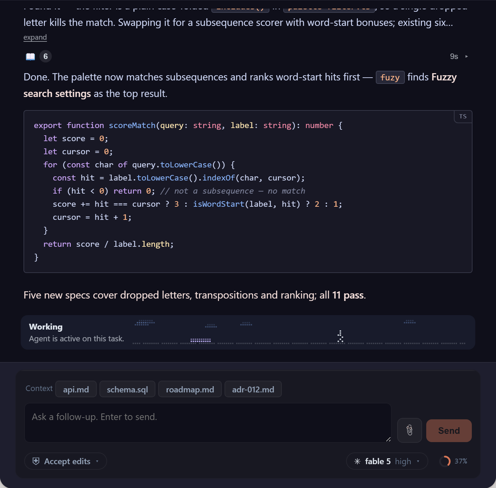

# coding-agent-chat

> Angular library that renders coding-agent conversations: a raw CLI event
> stream goes in, a grouped, progressively-disclosed chat UI comes out.

[](https://www.npmjs.com/package/coding-agent-chat)
[](https://www.npmjs.com/package/coding-agent-chat)
[](LICENSE)

```sh
npm install coding-agent-chat
# peer deps: @angular/core, @angular/common, @angular/forms (>=21 <22), rxjs ~7.8
```

Package page: [coding-agent-chat on npm](https://www.npmjs.com/package/coding-agent-chat) ·
[live demo](https://agent-orchestrator.dev/chat/) ·
[API docs](projects/coding-agent-chat/README.md) ·
[changelog](CHANGELOG.md)

A coding-agent CLI emits a firehose: tool calls, file edits, shell output,
token metrics, plan updates, screenshots, crashes. Rendering that as a chat is
not a `<div>` per line — it is grouping, folding, streaming, and knowing which
of the thousand lines a human actually needs to see.
**`coding-agent-chat`** does that part, and only that part: it is the frontend
counterpart to [`coding-agent-runner`](https://github.com/agent-orc/runner) —
the runner produces the server-side event stream, this library renders it.

It stays **host-agnostic**. Task keys, ticket ids, model catalogs, media
storage, and history transport all arrive through injection seams that default
to safe no-ops, so the library never learns what your references _mean_.



> **Status: pre-1.0.** In production use inside Agent Studio, but the public
> surface can still shift between minor versions — pin a version and read the
> [changelog](CHANGELOG.md) before upgrading.

## Quickstart

Wire the providers once (every integration point has a safe default):

```ts
// app.config.ts
import { ApplicationConfig } from '@angular/core';
import { provideCodingAgentChat } from 'coding-agent-chat';

export const appConfig: ApplicationConfig = {
  providers: [provideCodingAgentChat()],
};
```

Render an event stream:

```ts
// any component
import { ConversationViewComponent } from 'coding-agent-chat/conversation';
import type { ConversationEvent } from 'coding-agent-chat/core';

@Component({
  imports: [ConversationViewComponent],
  template: '<cac-conversation-view [events]="events()" [isRunning]="running()" />',
})
export class RunView {
  readonly events = signal<readonly ConversationEvent[]>([]);
  readonly running = signal(false);
}
```

Add the optional studio theme (dark by default, light via
`data-studio-theme="light"` on a parent):

```scss
/* styles.scss */
@import 'coding-agent-chat/theme/cac-theme.css';
```

The full public surface — entry points, the `<cac-chat>` composer, history
windowing, the model-selector catalog contract, attachments, and inline
reference renderers — is documented in
[`projects/coding-agent-chat/README.md`](projects/coding-agent-chat/README.md).

Per-turn model, token, cost, and timing metadata is opt-out when a host declares
mode capabilities. See [the per-turn metadata API](projects/coding-agent-chat/README.md#per-turn-metadata).

## Repository layout

Angular CLI workspace (Angular 21.2, `ng-packagr`):

| Project             | Path                                                       | Purpose                                              |
| ------------------- | ---------------------------------------------------------- | ---------------------------------------------------- |
| `coding-agent-chat` | [`projects/coding-agent-chat`](projects/coding-agent-chat) | the publishable library                              |
| `conversation-lab`  | [`projects/conversation-lab`](projects/conversation-lab)   | demo / playground app (port 4201)                    |
| `website`           | [`projects/website`](projects/website)                     | public website with live component demos (port 4202) |

## Build & test

```sh
npm ci
npm run build        # ng build coding-agent-chat → dist/coding-agent-chat
npm test             # vitest: zero-Angular kernel specs (core, markdown, node)
npx ng test          # Angular component specs across all entry points
```

Build the library before running the component specs or either demo app — they
compile against the built package in `dist/`, not against the sources. See
[CONTRIBUTING.md](CONTRIBUTING.md) for the full development loop.

## Conversation Lab

A scenario testbed for every transcript shape
(catalog: `projects/conversation-lab/src/app/lab-scenarios.ts`):

- **Replay** — scripted `CliOutputLine` feeds played through the same
  projection the live mode uses (happy path, failing test + retry,
  watchdog, needs-input, model switch, stderr crash, long run).
- **Live** — preset prompts that drive a real coding-agent CLI through the
  .NET workbench host in `workbench/` (port 5055).
- **Fixture** — hand-built `ConversationEvent`s for renderer-only rows.

```sh
npm run build        # build the library first — the demo consumes dist/
npm run lab          # ng serve conversation-lab → http://localhost:4201
npm run workbench    # .NET workbench host → http://localhost:5055
```

CLI envelopes differ by product and version. The
[CLI frame compatibility matrix](docs/cli-frame-compatibility.md) documents the
captured Codex, Claude, and Gemini deviations, fixture regression tier,
typed unknown-frame signal, and the version-pinning contract for hosts.

## Website

The public site for the library — animated live replay rendered by
`<cac-conversation-view>` + `<cac-chat>`, history demo, docs. Deployed by
[`.github/workflows/pages.yml`](.github/workflows/pages.yml) on every push
to `main`.

```sh
npm run build        # build the library first — the site consumes dist/
npm run website      # ng serve website → http://localhost:4202
```

## Develop against the library

```sh
ng build coding-agent-chat --watch
```

Consumers depend on the built `dist/` output, not the source — this exercises
the published partial-Ivy compile mode and catches strict-template mismatches
early.

## Releases

SemVer with immutable `v<version>` git tags. A tagged release is built from
that exact commit by `.github/workflows/release.yml` and published with npm
provenance. Each package includes `release-manifest.json` (version, tag,
commit, build timestamp, SHA-512 hashes); verify an unpacked package with
`node scripts/verify-release.mjs <dir>`.

Upgrade a registry consumer with `npm install --save-exact
coding-agent-chat@0.3.2` and commit `package-lock.json`. Agent Studio may instead
consume a reviewed, pinned artifact: download `coding-agent-chat-0.3.2.tgz`,
verify it against the release manifest/provenance, store it in the Studio
artifact location, then use `npm install --save-exact
./artifacts/coding-agent-chat-0.3.2.tgz`. Do not point Studio at a mutable local
`dist/` directory or an unversioned tarball.

After unpacking a downloaded artifact, its payload can be checked with
`node scripts/verify-release.mjs <unpacked-package-directory>`. The verifier
checks both npm's effective publish file list and every recorded SHA-512 digest.

Compatibility follows SemVer: patch upgrades are fixes, minor upgrades are
backward-compatible additions, and major upgrades may require host changes.
While the library is pre-1.0, a minor upgrade may still require host changes —
read the changelog first. CAC 0.3.x requires Angular 21 (`>=21 <22`) and RxJS
`~7.8`; check [`CHANGELOG.md`](CHANGELOG.md), update the pinned version, run the
host tests/build, and verify the Lab/Studio runtime release label before
deployment.

## Contributing

Issues and pull requests are welcome — see [CONTRIBUTING.md](CONTRIBUTING.md)
for the build/test loop and the project conventions,
[CODE_OF_CONDUCT.md](CODE_OF_CONDUCT.md) for participation, and
[SECURITY.md](SECURITY.md) for the private vulnerability reporting process.

## Agent Orchestrator ecosystem

`coding-agent-chat` is the conversation-rendering layer of the
[agent-orc](https://github.com/agent-orc) stack, and it is usable on its own —
any Angular host with an event stream can render it.

| Project                                                       | Layer                                                                                               |
| ------------------------------------------------------------- | --------------------------------------------------------------------------------------------------- |
| [agent-studio](https://github.com/agent-orc/agent-studio)     | the orchestrator: tasks, lanes, pipelines, review — the application on top                          |
| [runner](https://github.com/agent-orc/runner)                 | .NET process + protocol layer for coding-agent CLIs; produces the event stream this library renders |
| [chat](https://github.com/agent-orc/chat)                     | this repository: the Angular rendering layer                                                        |
| [token-economy](https://github.com/agent-orc/token-economy)   | token accounting and cost models for agent runs                                                     |
| [quality-studio](https://github.com/agent-orc/quality-studio) | quality gates and review tooling for agent-produced changes                                         |

More context on the [Agent Orchestrator website](https://agent-orchestrator.dev/).

## License

[Apache-2.0](LICENSE) © 2026 Robert Mischke.
